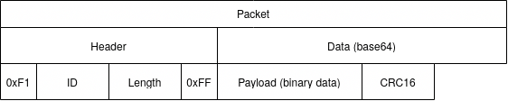
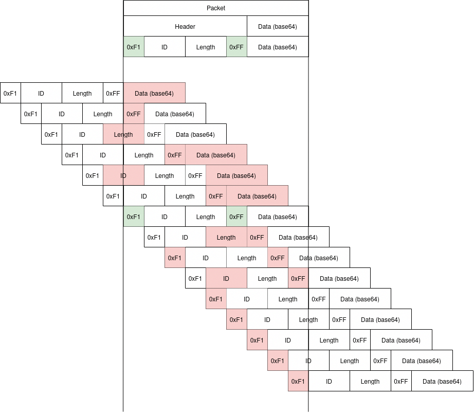

# Jitter Frame Format

A simple, easy to parse and robust serial frame format.
Intended for reliable data transmission in embedded applications, for example communication between a microcontroller and host device via UART or similar low-level protocols.

## Scope

The protocol defines a data frame-format, but is not a full network stack:

- No higher-level concepts such as data streams or delivery guarantees
- No requirements of specific electrical interface protocols (e.g. it can work over serial, RS485, or something else)

## Features

### Clear distinction between packet header and payload data

The protocol must be able to handle any payload data without making assumptions about 'unlikely' or 'special' data patterns such as:

- pseudorandom data (i.e. noisy sensor data, encrypted data)
- long sequences of ones or zeroes
- untrusted user-input (worst-case: crafted to confuse/exploit protocol parsers)

 This is implemented by base-64 encoding the payload data, while the packet headers contain some bit patterns that cannot be represented in base-64. This guarantees that payload data can never be mistaken for packet header data (and vice versa).

### Robust recovery from invalid data / FIFO overflow

The protocol is designed to guarantee recovery from:

- temporarily not keeping up with incoming data
- receiving partial packets (timeout)
- hot-plugging while another device is already sending data

These situations may occasionally happen due to logic or timing behavior, even on platforms where the electrical layer is perfectly noise free.

The incoming data stream can be syncronized to the start of a new frame by scanning for a particular bit pattern that only occurs once in a valid packet.

### Detection of data corrupt

The protocol is targeted for short-range communication where random bit-flips / noise is relatively rare: A 16-bit CRC checksum is used to detect corruption of payload data.

If your application expect strong electrical interference (e.g. long-range, wireless transmission), a protocol with more more elaborate checksums or error-correcting encoding may be more appropriate.

## Packet format

The protocol defines a packet containing a `Header` and `Data` section. Each packet may carry up to `46269` bytes of data and is tagged with a `ID` value in the range `0x0000-0xF0FF`. Note that all fields use little-endian byte ordering.

### Header

The header contains four fields:

- `0xF1`: marks *start-of-frame*
- `ID` (u16, little endian): identifies the type of content in this frame. Can be any value `0` - `0xF0FF`.
- `Length`(u16, little endian): length of the data section (`0` - `0xF0FF`). Note that this length includes the protocol overhead. The maximum size of actual payload data is `(0xF0FF * 6)/8 - 2 = 46269` bytes
- `0xFF`: marks *end-of-header*

The *start-of-frame* / *end-of-header* values make it easy to guarantee correct parsing when recovering from data corruption. The values are chosen to meet the following criteria:

- outside the range of valid base-64
- must not occur in the high byte of the `ID` or `Length` field (for maximum robustness when syncronizing). `0xFF` is a convenient value as it reduces the range of those fields the least.
- different from each other: `0xF1` still has minimum impact on the range of `ID` / `Length` and at the same time encodes the protocol version (V1)

### Data

The data section contains two fields:

- `Payload`: any sequence of up to 46269 bytes (zero length is also valid)
- `CRC16`(u16, little endian): CRC16 checksum over the payload. The CRC16-USB algorithm is used.

The complete data section (including CRC16) is base64-encoded with the standard base64 charset (`A-Za-z0-9+/`).

While base64 encoding comes with a small overhead, it comes with a big advantage: arbitrary binary data can be encapsulated without risk of confusing it for a packet header (the base64 character set does not cover `0xF1` / `0xFF`).

## Syncronizing to incoming data at arbitrary offset

This section attempts to visualize how the protocol guarantees (re-)syncronization to incoming data frames (which may happen when hot-plugging devices, recovering from corruption, FIFO overflow etc).

The figure compares an expected packet with incoming data at all possible byte offsets. Highlighted in red are the fields where the parser can detect a mismatch. Note that there is only one offset where the data is valid: this holds for all valid values of `ID` and `Length`. In all other cases the mismatch is detected by:
- 0xF1 != 0xFF
- 0xF1 cannot occur in second byte of `ID`, `Length` or base64 data
- 0xFF cannot occur in second byte of `ID`, `Length` or base64 data
